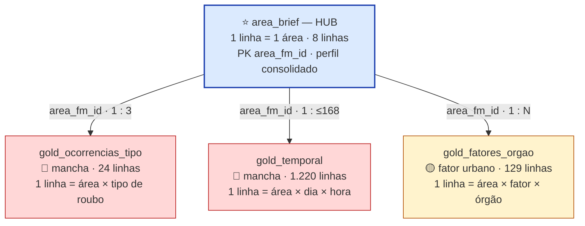
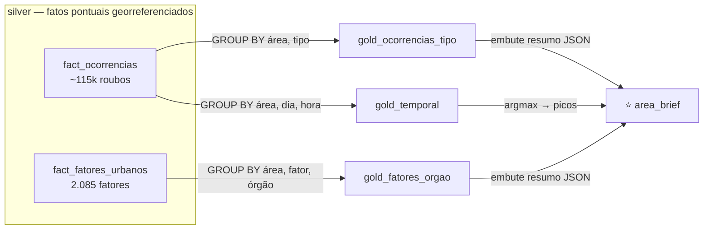
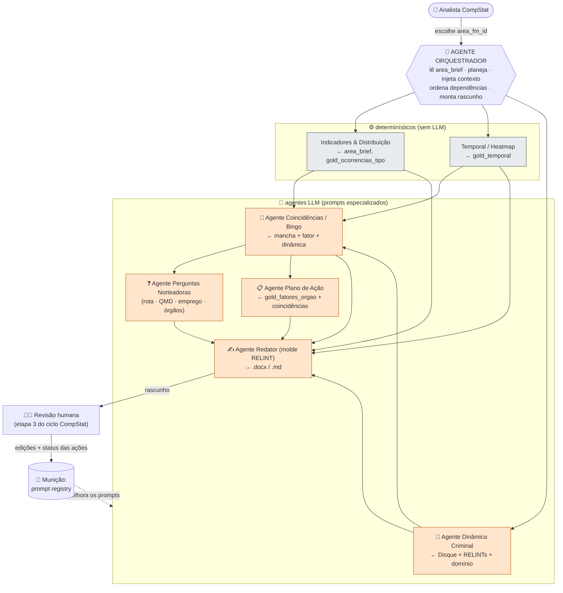
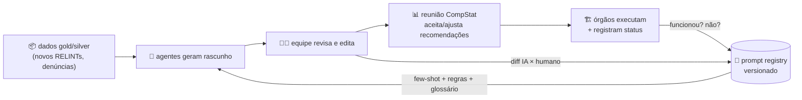

# Camada Gold — Mapa de Relações entre os CSVs + Arquitetura de Agentes de IA

> **O que é este documento:** um guia visual de (I) **como os 4 CSVs da pasta `gold/` se conectam** e (II) **como usar prompts/agentes de IA em cima desse "match" para gerar o Relatório Analítico de Área** exigido pelo briefing do hackathon.
> **Complementa** o [`../MODELO_DE_DADOS.md`](../MODELO_DE_DADOS.md) (que cobre todas as camadas bronze→silver→gold). Aqui o foco é a **pasta `gold/`** e a ponte dela com o produto.
> **Proveniência:** números e relações extraídos diretamente dos arquivos em 24/05/2026 (não são estimativas). Requisitos da Parte II ancorados em `Briefing_Hackathon_Desenvolvedores_CompStat-2.pdf`.

---

# PARTE I — Como os 4 CSVs se conectam

## 1. A ideia em 10 segundos

```
              ┌──────────────────────────────────────────────┐
              │   area_brief.csv  = 1 linha por ÁREA (o HUB)  │
              │   8 áreas · perfil consolidado e pronto       │
              └───────────────────┬──────────────────────────┘
                                  │  ligados por  area_fm_id
        ┌─────────────────────────┼─────────────────────────┐
        ▼                         ▼                         ▼
 gold_ocorrencias_tipo      gold_temporal           gold_fatores_orgao
  (o QUÊ: tipo de roubo)   (o QUANDO: dia×hora)    (a CONDIÇÃO + QUEM resolve)
```

> **Uma só chave liga tudo: `area_fm_id`.** O `area_brief` é a tabela-mãe (1 linha = 1 área); os outros três são o **detalhamento "explodido"** (várias linhas por área) dos blocos que o brief guarda resumidos em JSON. Quase todo cruzamento é um `JOIN ... USING (area_fm_id)`.

## 2. As 4 tabelas num relance

| Arquivo | Grão (o que é 1 linha) | Linhas | Forma | Camada do "bingo" | Papel |
|---|---|---:|---|---|---|
| **`area_brief.csv`** | 1 **área** | 8 | *wide* (1 col = 1 atributo, alguns em JSON) | consolidado | **Hub** — perfil pronto que o relatório consome |
| `gold_ocorrencias_tipo.csv` | área × **tipo de roubo** | 24 | *long/tidy* | 🔴 mancha criminal | Distribuição de delitos por tipo |
| `gold_temporal.csv` | área × **dia × hora** | 1.220 | *long/tidy* | 🔴 mancha criminal | Matriz temporal (picos) |
| `gold_fatores_orgao.csv` | área × **fator × órgão** | 129 | *long/tidy* | 🟡 fator urbano | Fator urbano + órgão responsável |

As **8 áreas** são idênticas nos quatro arquivos (`area_fm_id` ∈ {2, 9, 10, 11, 12, 14, 19, 20}) — integridade referencial perfeita.

| id | área | rank | total roubos |
|---:|---|:--:|---:|
| 20 | Presidente Vargas · Campo de Santana · Central · Cinelândia | 1 | 4.011 |
| 2 | Rodoviária · Terminal Gentileza · Estação Leopoldina | 2 | 1.974 |
| 19 | Estações São Francisco Xavier · Afonso Pena | 3 | 1.507 |
| 14 | Praia de Botafogo · Rua Marquês de Abrantes | 4 | 1.138 |
| 9 | Metrô Botafogo · São Clemente · Voluntários | 5 | 821 |
| 12 | Rio Sul | 6 | 457 |
| 10 | Jardim de Alah | 7 | 298 |
| 11 | Campo Grande: Estação de Trem · Calçadão | 8 | 294 |

## 3. Diagrama estrela (hub-and-spoke)



## 4. Diagrama de entidade-relacionamento

```mermaid
erDiagram
    area_brief ||--|{ gold_ocorrencias_tipo : "area_fm_id · 3 por area"
    area_brief ||--o{ gold_temporal : "area_fm_id · ate 168 por area"
    area_brief ||--o{ gold_fatores_orgao : "area_fm_id · N por area"

    area_brief {
        int area_fm_id PK
        string nome_area
        int total_ocorrencias
        int ranking_ocorrencias
        json ocorrencias_por_tipo "resumo de gold_ocorrencias_tipo"
        string pico_dia_semana "argmax de gold_temporal"
        int pico_hora "argmax de gold_temporal"
        json fatores_por_orgao "resumo de gold_fatores_orgao"
        json dinamica "PENDENTE extracao LLM"
        string geometry_wkt
    }
    gold_ocorrencias_tipo {
        int area_fm_id FK
        string category "tipo de roubo"
        int qtd
    }
    gold_temporal {
        int area_fm_id FK
        string dia_semana
        int hora
        int qtd
    }
    gold_fatores_orgao {
        int area_fm_id FK
        string category "fator urbano"
        string orgao_responsavel
        int qtd
    }
```



## 5. O hub em detalhe — as 19 colunas de `area_brief`

Agrupadas por função. A coluna **"conecta com"** é a chave para a Parte II: repare que os campos 🔵 de dinâmica estão **vazios/pendentes** — é exatamente o que os agentes de IA vão preencher.

| Campo | Tipo | O que é | Conecta com |
|---|---|---|---|
| `area_fm_id` | int | **PK** — polígono FM (2,9,10,11,12,14,19,20) | 🔑 junção com os 3 spokes e o silver |
| `nome_area` | texto | Nome da subárea FM | Identificação do relatório |
| `total_ocorrencias` | int | Total de roubos na área | Indicadores do período |
| `ranking_ocorrencias` | int | Posição 1–8 por volume | Indicadores (ranking entre áreas) |
| `n_disque` | int | Nº de denúncias na área | 🔵 silver `fact_disque_denuncia` |
| `n_cameras` | int | Nº de câmeras na área | ⚪ silver `fact_cameras` |
| `n_psr_cpsr` | int | Volume agregado de pop. em situação de rua / CPSR | 🟡 silver `agg_cpsr_area_ano` |
| `pico_dia_semana` | texto | Dia de maior incidência (argmax) | 🔴 derivado de `gold_temporal` |
| `pico_hora` | int | Hora de maior incidência (argmax) | 🔴 derivado de `gold_temporal` |
| `ocorrencias_por_tipo` | json | `{tipo: qtd}` | 🔴 **= `gold_ocorrencias_tipo`** (forma wide) |
| `janelas_pico` | json | `[{dia,hora,qtd}]` top janelas | 🔴 derivado de `gold_temporal` |
| `fatores_por_tipo` | json | `{fator: qtd}` | 🟡 `gold_fatores_orgao` agregado por `category` |
| `fatores_por_orgao` | json | `{orgao: qtd}` | 🟡 `gold_fatores_orgao` agregado por `orgao_responsavel` |
| `faccoes_influencia` | json | lista de facções (ex.: `["TCP"]`) | 🔵 silver `dim_dominio_territorial` (indício) |
| `dinamica` | json | **`{"_status":"pendente_extracao_llm"}`** | 🔵 **a preencher pelo Agente Dinâmica** |
| `fontes_dinamica` | json | citações da síntese (hoje `[]`) | 🔵 proveniência da dinâmica |
| `confianca_dinamica` | texto | **`pendente`** | 🔵 confiança da síntese |
| `avisos` | json | ressalvas de governança/LGPD | rodapé do relatório |
| `geometry_wkt` | texto | `POLYGON(...)` da área | silver `dim_area_fm`, heatmap, vizinhança |

## 6. Os 3 spokes em detalhe

| Spoke | Colunas | Cardinalidade real | Ligação de volta ao brief |
|---|---|---|---|
| **`gold_ocorrencias_tipo`** | `area_fm_id, category, qtd` | **3 por área** (Roubo a transeunte · de aparelho celular · em coletivo) | Agregue → reconstrói `ocorrencias_por_tipo` |
| **`gold_temporal`** | `area_fm_id, dia_semana, hora, qtd` | **120–168 por área** (grade até 7 dias × 24 h) | `argmax` → `pico_dia_semana`/`pico_hora`/`janelas_pico` |
| **`gold_fatores_orgao`** | `area_fm_id, category, orgao_responsavel, qtd` | **13–19 por área** (20 fatores; 8 órgãos: CET-Rio, COMLURB, GM-Rio, Rio Luz, SECONSERVA, SEOP, SMAS, SMTR) | Agregue por `category` → `fatores_por_tipo`; por `orgao` → `fatores_por_orgao` |

> **Por que existem as duas formas (wide *e* long)?** O `area_brief` (wide/JSON) é para **leitura direta** — o relatório e o LLM consomem o perfil de uma área numa linha só. Os spokes (long/tidy) são para **agregar, ordenar e plotar** — heatmaps, rankings e `GROUP BY`. Mesma verdade, dois formatos.

## 7. Prova de consistência (wide ↔ long)

Verificado na área 2 (Rodoviária): agregar o spoke reproduz **exatamente** o JSON do brief.

```
gold_fatores_orgao (área 2), somando qtd por órgão     area_brief.fatores_por_orgao (área 2)
  COMLURB    = 11                                          {"COMLURB": 11,
  Rio Luz    = 10                                           "Rio Luz": 10,
  CET-Rio    =  9                            ≡              "CET-Rio": 9,
  SECONSERVA =  7                                           "SECONSERVA": 7,
  SMAS       =  5                                           "SMAS": 5,
  GM-Rio     =  4                                           "GM-Rio": 4,
  SEOP       =  1                                           "SEOP": 1}
```

O mesmo vale para `gold_ocorrencias_tipo` ≡ `ocorrencias_por_tipo`. **Os blocos JSON do brief são resumos pré-computados das long tables** — não uma fonte independente.

## 8. Como cruzar — receitas prontas (DuckDB, rodando dentro de `gold/`)

```sql
-- (a) Perfil da área + seus tipos de roubo  (hub + spoke)
SELECT b.area_fm_id, b.nome_area, t.category, t.qtd
FROM 'area_brief.csv' b
JOIN 'gold_ocorrencias_tipo.csv' t USING (area_fm_id)
ORDER BY b.ranking_ocorrencias, t.qtd DESC;

-- (b) Heatmap dia × hora de uma área  (spoke temporal → Análise Temporal do relatório)
SELECT dia_semana, hora, qtd
FROM 'gold_temporal.csv'
WHERE area_fm_id = 20
ORDER BY qtd DESC;

-- (c) Fatores priorizados + quem resolve  (spoke fatores → Plano de Ação)
SELECT category AS fator, orgao_responsavel, qtd
FROM 'gold_fatores_orgao.csv'
WHERE area_fm_id = 20
ORDER BY qtd DESC;

-- (d) Reconstruir o resumo do brief a partir do spoke (prova da seção 7)
SELECT orgao_responsavel, sum(qtd) AS total
FROM 'gold_fatores_orgao.csv'
WHERE area_fm_id = 2
GROUP BY 1 ORDER BY total DESC;
```

## 9. De onde vêm (derivação silver → gold)



> O `area_fm_id` de toda fonte vem de **point-in-polygon** sobre os 8 polígonos da FM (`geometry_wkt`) — nunca do nome textual da área (ver ressalva no `MODELO_DE_DADOS.md`).

## 10. Integridade e cardinalidades observadas

- ✅ Os **8 `area_fm_id` batem** nos 4 arquivos (nenhuma área órfã).
- 🔴 `gold_ocorrencias_tipo`: **exatamente 3 linhas/área** (só roubo — sem furto).
- 🔴 `gold_temporal`: 120–168 linhas/área (≤ 7×24; horas sem ocorrência podem não aparecer).
- 🟡 `gold_fatores_orgao`: 13–19 linhas/área (cruzamento fator × órgão).

---

# PARTE II — Da camada gold ao relatório: prompts e agentes de IA

> **Pedido:** como usar **prompts em conjunto** (agentes especializados, com instruções **municiadas e melhoradas ao longo do tempo**) para **enriquecer** o relatório que a IA já entrega pré-preenchido pelo *match* da camada gold — com foco na **dinâmica criminal** e, se fizer sentido, um **agente orquestrador**. Tudo abaixo é ancorado no briefing técnico (seções 6, 7, 8, 10 e no modelo de referência do Anexo).

## 11. Onde a IA entra: do *match* (gold) ao relatório (briefing)

O briefing (§6.1) define **8 blocos** no Relatório Analítico de Área. A camada gold já resolve sozinha a parte **quantitativa**; a IA agrega valor na parte **qualitativa e de recomendação** — exatamente o que o briefing chama de "principal diferencial" (§4.1).

| Bloco do relatório (§6.1) | De onde sai o dado | Precisa de LLM? |
|---|---|:--:|
| Identificação da Área | `area_brief` (nome, facção, geo) | ❌ |
| Indicadores do Período | `area_brief` (total, ranking) | ❌ |
| Distribuição por Tipo | `gold_ocorrencias_tipo` | ❌ |
| Análise Temporal (heatmap, picos) | `gold_temporal` | ❌ |
| **Dinâmica Criminal** | silver `fact_disque_denuncia` + RELINTs + domínio | ✅ **núcleo** |
| Fatores de Incidência | `gold_fatores_orgao` (+ descrição via LLM) | ⚙️ parcial |
| **Painel de Coincidências** (score/bingo) | cruzamento das 3 camadas | ✅ |
| **Plano de Ação** (ações + responsável) | `gold_fatores_orgao` + coincidências | ✅ |

> **Princípio de eficiência:** acionar LLM **só onde há texto a interpretar ou decisão a justificar**. Heatmap, ranking e indicadores são templates determinísticos sobre a gold — não gastam token nem inventam número.

## 12. Arquitetura proposta — orquestrador + agentes especialistas

**Sim, um orquestrador se justifica** (resposta direta ao "se necessário"): há **dependências** entre os blocos (a dinâmica alimenta as coincidências, que alimentam o plano de ação e as 4 perguntas), há **mistura** de etapas determinísticas e LLM, e há um **loop de revisão humana** semanal a coordenar. O orquestrador é quem lê o `area_brief`, decide o que cada agente recebe (injeta só o contexto da área — economia e foco) e monta o rascunho.



## 13. Catálogo de agentes (o "prompt em conjunto")

Cada agente = **um prompt especializado** com missão estreita, entradas explícitas e saída mapeada a um bloco do relatório. Prompts curtos e focados erram menos e são mais fáceis de melhorar.

| Agente | Missão do prompt (resumo) | Entradas | Saída → bloco |
|---|---|---|---|
| 🧭 **Orquestrador** | "Dado um `area_fm_id`, planeje a ordem, injete só o contexto da área em cada agente e monte o Relatório no molde RELINT; só acione LLM onde há texto/decisão." | `area_brief` | rascunho completo |
| ⚙️ Indicadores/Distribuição | (template) ranking, total, %, posição | `area_brief`, `gold_ocorrencias_tipo` | Indicadores · Distribuição |
| ⚙️ Temporal | (template) matriz dia×hora, período predominante, dia/horário crítico | `gold_temporal` | Análise Temporal |
| 🔵 **Dinâmica Criminal** | "Extraia modalidade, modus operandi, rotas de fuga, pontos de receptação e influência de ORCRIM; **cada afirmação com trecho-fonte e confiança**." | `fact_disque_denuncia`, RELINTs, `dim_dominio_territorial` | Dinâmica Criminal |
| 🎯 **Coincidências/Bingo** | "Cruze mancha (tipo+pico) × fator urbano × dinâmica; calcule score por nº de camadas sobrepostas e **justifique textualmente** quais coincidem." | saídas mancha+fator+dinâmica | Painel de Coincidências |
| ❓ **Perguntas Norteadoras** | "Responda as 4 perguntas (rota da FM · QMD vs pico · modelo de emprego moto/a pé/viatura+efetivo · órgãos×fatores) com **diagnóstico + sugestão de ação**." | tudo acima (+ QMD/efetivo externos) | Resumo Executivo |
| 📋 **Plano de Ação** | "Para cada fator relevante, gere ação concreta, órgão responsável e justificativa, **priorizando por relevância criminal** (peso da coincidência)." | `gold_fatores_orgao` + coincidências | Plano de Ação |
| ✍️ **Redator** | "Redija no tom e estrutura do RELINT de referência; preserve ressalvas/`avisos`; exporte PDF/DOCX." | todas as saídas | documento final |

## 14. Municiamento — como os prompts melhoram ao longo do tempo

O ciclo semanal do CompStat (briefing §8) **já é um loop de aprendizado** — basta capturá-lo. O rascunho da IA é revisado pela equipe (etapa 3) e, depois, os órgãos registram o **status de execução** das ações (etapa 5). Esses dois sinais são a "munição".



**O que entra como munição (e onde é aplicado):**

| Fonte de munição | Vira o quê no prompt | Exemplo |
|---|---|---|
| **Diff** rascunho-IA × versão-revisada | exemplos *few-shot* e regras de calibração | "não afirmar domínio de facção com 1 só denúncia" → regra no Agente Dinâmica |
| **Status de execução** das ações (funcionou?) | reordenação de prioridade no Plano de Ação | poda reduziu roubo no trecho X → reforça peso de "vegetação encobrindo iluminação" |
| **Novos RELINTs / denúncias** | atualização de contexto e glossário de domínio | gírias, codinomes, novos pontos de receptação |
| **Métricas por versão de prompt** | seleção A/B do melhor prompt | taxa de edição humana ↓, confiança média ↑, aceitação na reunião ↑ |

**Mecanismo concreto:** cada agente tem seu prompt **versionado** num *registry* (`agente@vN`), com métricas por versão. Promove-se a versão que reduz edição humana e aumenta aceitação. Assim os prompts não são estáticos — são **municiados** a cada ciclo, e o sistema fica melhor sozinho conforme roda.

## 15. Pontos novos a considerar — dinâmica criminal (o diferencial)

A dinâmica é hoje o **vazio** da gold (`area_brief.dinamica = pendente_extracao_llm`, `fontes_dinamica = []`, `confianca_dinamica = pendente`) e o que o briefing (§4.1, §7.1) aponta como o **diferencial** frente a um BI comum. Pontos a embutir nos prompts do Agente Dinâmica:

- **Proveniência + confiança obrigatórias.** Toda afirmação carrega `trecho_fonte`, `doc_id` e `confianca` (o schema `silver/dinamica_extraida` já prevê isso). Disque é **indício, não fato** — o texto do relatório precisa citar a fonte.
- **Guardrails de LGPD.** `relato_redacted` tem PII mascarada de forma **imperfeita** e o bloco `envolvidos.*` (nome/idade/cor) **não** foi propagado. Regra dura no prompt: **não reidentificar pessoas, não inferir raça/nome**.
- **Facção como hipótese.** `dim_dominio_territorial` é **colaborativo, não oficial**. O prompt deve tratar `faccoes_influencia` como indício a corroborar, nunca como fato consolidado.
- **Temporalidade da dinâmica.** Modus operandi muda (sazonalidade, resposta policial). Datar as afirmações e **decair a confiança** de relatos antigos.
- **Eixos que decidem operação:** `deslocamento_autor` (moto/a pé) alimenta diretamente a **pergunta 3** (modelo de emprego — "se o roubo é por moto, efetivo a pé não resolve", §7.3); **rotas de fuga** sugerem análise **entre áreas vizinhas** (adjacência via `geometry_wkt`); **pontos de receptação** abrem um eixo econômico de ação.
- **Eixo ainda sem fonte:** inteligência de **redes sociais** (desafio extra do briefing) não tem dado no acervo — exigiria coleta externa antes de virar prompt.

## 16. Cobertura dos requisitos do briefing — o que já dá e o que vai faltar

> Resposta direta a "é necessário cumprir todos os requisitos". **Os 4 CSVs gold sozinhos não cobrem tudo** — eles entregam 100% do quantitativo, mas o qualitativo depende dos agentes (sobre o silver) e alguns itens dependem de **fonte/insumo externo** ou são de **engenharia de produto**. Legenda: ✅ pronto na gold · 🟡 via agente LLM/silver · 🟠 precisa de fonte/input externo · 🔴 fora do alcance dos dados atuais.

| Requisito (briefing) | Status | Lacuna / como cobrir |
|---|:--:|---|
| Identificação (nome, facção, geo) | ✅ | `area_brief` cobre |
| Identificação (AISP, DP, BPM, subprefeitura) | 🟠 | não está nos 4 CSVs gold — derivar de outra fonte/cadastro |
| Indicadores: roubos, ranking | ✅ | `area_brief` |
| Indicadores: **furtos** | 🔴 | acervo só tem **roubo** — exige nova fonte |
| Indicadores: evolução mensal / variação | 🟠 | "será disponibilizado com registros da FM-Rio" |
| Distribuição por tipo (+%) | ✅ | `gold_ocorrencias_tipo` (% calculável) |
| Análise temporal (matriz, picos) | ✅ | `gold_temporal` — **ponto forte** |
| **Dinâmica criminal (síntese)** | 🟡 | **pendente** — Agente Dinâmica sobre Disque/RELINT/domínio (o núcleo do trabalho) |
| Fatores de incidência (fator + órgão) | ✅ | `gold_fatores_orgao` |
| Fatores: descrição textual rica | 🟡 | Agente sobre RELINT (modelo de referência tem descrições longas) |
| Painel de coincidências (score) | 🟡 | Agente Bingo — **depende da dinâmica** estar pronta |
| Plano de ação (ações priorizadas) | 🟡 | matriz fator→órgão ✅; ações concretas via Agente Plano |
| Pergunta 1 — **rota da FM (trechos)** | 🔴 | gold é **por área**, não por segmento viário — falta malha de trechos (MVP por área) |
| Pergunta 2 — QMD × pico | 🟠 | pico ✅ (`gold_temporal`); **QMD atual da FM** é input externo |
| Pergunta 3 — modelo de emprego + efetivo | 🟡 🟠 | depende da dinâmica (moto/a pé) + **efetivo atual** por área (dos 600) é input FM |
| Pergunta 4 — órgãos × fatores | ✅ 🟡 | `gold_fatores_orgao` ✅; ações priorizadas via LLM |
| Cobertura das **22 áreas** prioritárias | 🟠 | gold cobre **8 de 22** (só as com polígono + dados) |
| Inteligência de redes sociais (extra) | 🔴 | sem fonte no repositório — coleta externa |
| Exportar PDF/DOCX · interface de revisão · painel das 22 áreas (§10.4/10.5) | 🟠 | engenharia de produto (não-dados) |

## 17. Veredito

1. **Orquestrador: recomendado.** As dependências (dinâmica → coincidências → plano/perguntas → redação) e a coordenação do loop humano justificam um maestro que injeta contexto por área e gere o `prompt registry`. Para 8 áreas é confortável; para as **22 áreas** e o ciclo semanal, ele paga o investimento.
2. **Prompts em conjunto, não um prompt gigante.** Agentes estreitos e versionados erram menos, são auditáveis (citação + confiança) e **melhoram a cada ciclo** com as edições humanas e o status das ações.
3. **Cumpre tudo? Não só com a gold.** O quantitativo está pronto; o **qualitativo (dinâmica)** é o trabalho central dos agentes; e há lacunas que exigem **decisão/fonte externa** (furtos, trechos viários, QMD/efetivo, 22 vs 8 áreas, redes sociais). Esses gaps precisam ser declarados como **escopo** — não descobertos no fim.

> **Governança (não esquecer):** todo `area_brief` é **rascunho** — priorização e decisão final são humanas (campo `avisos`). Os agentes pré-preenchem e justificam; quem decide é a reunião do CompStat.
