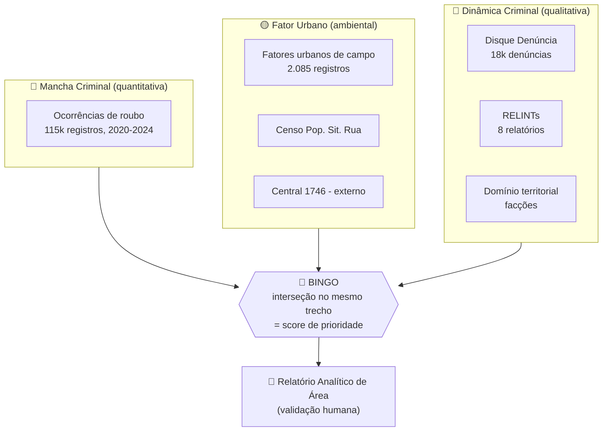

# CompStat Rio — Visão Geral e Mapa da Documentação

> **Para quem é isto:** o time funcional/analista do Claude Impact Lab.
> **Objetivo desta pasta `docs/`:** ler todos os dados que chegaram, arquitetá-los, inferir a utilidade de cada um e organizar as possibilidades — para decidirmos **por onde começar** já enxergando os dados reais e seus limites.
> **Data da análise:** 24/05/2026. Todos os números aqui foram extraídos diretamente dos arquivos do repositório (não são estimativas).

---

## 1. O projeto em 30 segundos

O **CompStat Rio** é uma plataforma que cruza camadas de dados de segurança pública municipal, calcula um **score de prioridade** por trecho/área e gera um **relatório de decisão** que a equipe humana valida antes de agir. Ele automatiza o passo hoje manual — compilar e cruzar planilhas — para devolver tempo de análise às 22 áreas monitoradas.

A inteligência central é sobrepor, no mesmo ponto do mapa, **três camadas**: onde o crime acontece (**mancha criminal**), qual condição urbana o facilita (**fator urbano**) e qual a dinâmica por trás dele (**dinâmica criminal**). Quando as três coincidem no mesmo segmento, o sistema marca um **"bingo"** e atribui prioridade máxima.

> O conceito, o glossário de domínio e o roadmap original estão em [`ideiainicial.md`](../../ideiainicial.md) (o spec que um funcional montou a partir da apresentação dos stakeholders). **Esta documentação é o complemento dele com os dados reais** — que, à época daquele texto, ainda estavam "pendentes".

## 2. O problema (resumo)

Os dados vivem em silos: ocorrências georreferenciadas, denúncias qualitativas, fatores urbanos de campo e relatórios de inteligência não se cruzam automaticamente. Produzir os **Relatórios Analíticos de Área** que subsidiam as reuniões semanais de CompStat consome horas de compilação manual. A IA entra para amplificar a análise — síntese qualitativa, cruzamento geoespacial e recomendações — para que o analista decida, não monte planilha.

## 3. As 3 camadas e o "bingo"

Exemplo de saída esperada: *"Score 8.5/10 — trecho X tem roubos noturnos (mancha), poste apagado (fator) e rota de fuga citada em RELINT (dinâmica)."*

## 4. O inventário dos dados que chegaram

Nove fontes (5 do modelo original + 4 de apoio) + uma externa. Números verificados nos arquivos:

| # | Fonte | Camada | Arquivo | Volume | Período |
|---|-------|--------|---------|--------|---------|
| 1 | **Ocorrências criminais** | Mancha | `dados/df_ocorrencias_tratado - Extração 1 .csv` | 115.354 linhas | 2020-2024 |
| 2 | **Disque Denúncia** | Dinâmica | `dados/disk_denuncia.csv` | 18.003 denúncias (83.549 linhas) | 2019-2026 |
| 3 | **Fatores urbanos** | Fator | `dados/fatores_urbanos.csv` | 2.085 registros | — |
| 4 | **Polígonos FM** | Território | `sh_area_forca/areas_forca_municipal.*` | 8 áreas | — |
| 5 | **RELINTs** | Dinâmica / molde | `relints/RI_010..017_2026_*.docx` | 8 relatórios | 2026 |
| 6 | **Câmeras** | Suporte | `dados/cameras_areas_fm.csv` | 985 câmeras (9 áreas) | — |
| 7 | **Domínio territorial** | Dinâmica (contexto) | `dados/outros dados/dominio_territorial - Extração 1.csv` | 1.628 territórios | — |
| 8 | **Censo Pop. Sit. Rua (CPSR)** | Fator (SMAS) | `dados/outros dados/CPSR_2020_2022_2024.xlsx` | 23.332 pessoas | 2020/2022/2024 |
| 9 | **Central 1746** | Validação de fator | externo — BigQuery `datario.adm_central_atendimento_1746.chamado` | base pública | desde 2010 |
| — | Dicionário de dados | referência | `dados/Dicionário de dados.xlsx` | 7 abas | — |

> ⚠️ **Achado-chave de escopo:** as **8 áreas** com polígono (fonte 4) batem **1:1 com os 8 RELINTs** (fonte 5). Essas 8 áreas têm a fatia de dados mais completa do repositório — são o candidato natural a MVP (ver [`04-como-comecar.md`](04-como-comecar.md)).

## 5. Como navegar esta documentação

| Documento | O que você encontra |
|-----------|---------------------|
| **[`01-arquitetura-de-dados.md`](01-arquitetura-de-dados.md)** | O catálogo técnico: schema real de cada fonte (coluna → tipo → descrição → exemplo), formato/encoding, modelo de dados, chaves de junção e **todos os achados de qualidade**. |
| **[`02-utilidades-por-fonte.md`](02-utilidades-por-fonte.md)** | A utilidade analítica de cada fonte: que pergunta do CompStat responde, que módulo do relatório alimenta, força e limitação. Inclui a Matriz Fatores × Órgãos e o molde do RELINT. |
| **[`03-possibilidades.md`](03-possibilidades.md)** | A visão de possibilidades: o desafio principal, os 4 desafios extras e ideias novas habilitadas pelos dados — cada uma com viabilidade e bloqueios. |
| **[`04-como-comecar.md`](04-como-comecar.md)** | A síntese do brainstorming: definição de MVP, sequenciamento, riscos/decisões em aberto, guardrails de IA responsável e checklist de primeiros passos. |

## 6. Princípios que atravessam tudo (guardrails)

Projeto de segurança pública. Detalhes em [`ideiainicial.md` §13](../../ideiainicial.md):

- **Decisão final sempre humana** — o sistema gera rascunho + score + justificativa; a equipe valida.
- **Foco no ambiente, não no indivíduo** — fatores urbanos e alocação de patrulha, não vigilância de pessoas.
- **Texto livre é indício, não fato** — Disque Denúncia e RELINT sinalizam incerteza e citam a fonte.
- **Nunca inventar dado** — camada ausente é declarada; score com dado insuficiente é marcado como baixa confiança.
- **Privacidade/LGPD** — trabalhar com agregados territoriais; minimizar dado pessoal (relevante p/ Disque Denúncia e CPSR).
