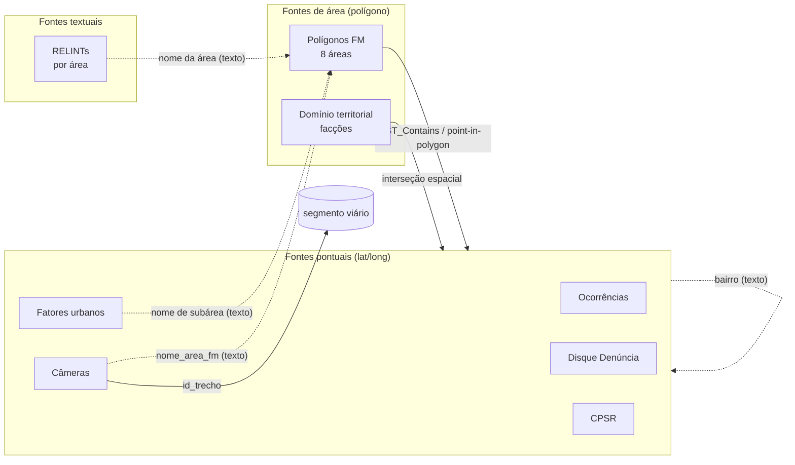

# 01 — Arquitetura de Dados

Catálogo técnico de todas as fontes. Cada ficha traz formato, volume e **schema real verificado no arquivo** (não no que o dicionário promete — onde os dois divergem, está sinalizado). Voltar para a [visão geral](00-visao-geral.md).

---

## 1. Modelo de dados e chaves de junção

Não existe uma chave primária comum entre as fontes. A integração é **majoritariamente espacial** (coordenadas e polígonos) e, secundariamente, por **nome de área/subárea** e **bairro**.

**Chaves disponíveis, da mais forte para a mais fraca:**

| Chave | Liga | Observação |
|-------|------|------------|
| **Coordenadas lat/long** | todas as fontes pontuais ↔ polígonos | A mais confiável. Permite point-in-polygon e proximidade (buffer). É o eixo do "bingo". |
| **Polígono de área FM** | recorta ocorrências, denúncias, fatores, câmeras, CPSR por área | Só 8 áreas têm polígono hoje. |
| **`id_trecho`** | câmeras ↔ segmento viário | Presente só em câmeras; falta a base de geometria dos trechos para fechar o elo (ver §11). |
| **Nome de área / subárea** (texto) | fatores ↔ câmeras ↔ shapefile ↔ RELINT | Requer normalização de string (grafias diferentes entre fontes). |
| **Bairro** (texto) | ocorrências, denúncias, fatores, CPSR | Granularidade grossa; bom para agregação, ruim para trecho. |

**Mapeamento fonte → camada do modelo:**

| Camada | Fontes |
|--------|--------|
| 🔴 **Mancha criminal** (quantitativa) | Ocorrências |
| 🟡 **Fator urbano** (ambiental) | Fatores urbanos · CPSR · Central 1746 |
| 🔵 **Dinâmica criminal** (qualitativa) | Disque Denúncia · RELINTs · Domínio territorial |
| ⚪ **Suporte territorial/operacional** | Polígonos FM · Câmeras |

---

## 2. Ocorrências criminais 🔴

| | |
|---|---|
| **Arquivo** | `dados/df_ocorrencias_tratado - Extração 1 .csv` (24 MB) |
| **Formato** | CSV, separador `,`, encoding UTF-8, ponto decimal |
| **Volume** | **115.354 linhas** × 14 colunas |
| **Período** | `ano` 2020–2024 (26.870 / 25.931 / 21.890 / 18.077 / 22.586) |
| **Geometria** | WKT `POINT(long lat)` na coluna `geometria` |
| **Escopo** | apenas cidade do Rio (dicionário) |

| Coluna | Tipo | Descrição | Exemplo |
|--------|------|-----------|---------|
| `id_criptografado` | texto (hash) | ID único da ocorrência | `0259749...` |
| `ano` | int | Ano do fato ✅ confiável | `2023` |
| `data` | data | Data do fato ⚠️ **ano corrompido** | `26/03/1924` |
| `mes` | int | Mês do fato ✅ | `5` |
| `hora` | hora | Hora do fato ✅ `HH:MM:SS` | `19:40:00` |
| `delito` | int (cód.) | Código do delito | `15` |
| `desc_delito` | texto | Descrição do delito | `Roubo a transeunte` |
| `longitude` / `latitude` | float | Coordenadas | `-43.26`, `-22.86` |
| `aisp` | int | Área Integrada de Seg. Pública (PMERJ) | `16` |
| `risp` | int | Região Integrada de Seg. Pública | `1` |
| `locf` | texto | Logradouro do fato | `Rua arapa` |
| `dia_semana` | texto | Dia da semana ✅ | `Quarta` |
| `geometria` | WKT | Ponto | `POINT(-43.26 -22.86)` |

**Distribuição dos delitos (3 tipos, todos roubo):** Roubo a transeunte 69.697 · Roubo de aparelho celular 33.288 · Roubo em coletivo 12.369. **17 AISPs, 2 RISPs.**

**Achados de qualidade:**
- ✅ **Temporal completo:** `hora`, `dia_semana` e `mes` preenchidos em 99,98% (só 22 linhas vazias). **A análise por horário/dia é totalmente viável** — desmente a suposição inicial de que faltava granularidade temporal.
- ⚠️ A coluna **`data` tem o ano corrompido** (aparecem 1924, 1972, 1980…) e **não bate com `ano`**. Use `ano` + `mes` + `hora` + `dia_semana`; ignore o ano de `data`.
- ⚠️ **Sem furto:** apesar de o dicionário dizer "roubos e furtos", só há 3 tipos de **roubo**. Furto não está representado.
- ⚠️ Dicionário diz cobertura **"2023 e 2024"**, mas os dados vão de **2020 a 2024**. E lista a coluna `rgocronu` (o CSV usa `id_criptografado`).
- ✅ Coordenadas 99,97% válidas; 36 linhas corrompidas (ex.: `-22806`) — filtrar por bounding box do Rio.

---

## 3. Disque Denúncia 🔵

| | |
|---|---|
| **Arquivo** | `dados/disk_denuncia.csv` (19 MB) |
| **Formato** | CSV, separador **`;`**, encoding **latin-1 (ISO-8859-1)**, **vírgula decimal** |
| **Volume** | **83.549 linhas = 18.003 denúncias** + 65.546 linhas de explosão |
| **Período** | `data_denuncia` 2019–2026 |

**Estrutura "explodida":** cada denúncia gera várias linhas (uma por órgão/assunto vinculado). Só as **18.003 linhas-cabeça** (com `numero_denuncia` preenchido) trazem localização e relato; as demais repetem só os campos de órgão/assunto. As colunas têm notação de JSON achatado (`assuntos.*`, `envolvidos.*`).

Colunas principais (48 no total):

| Bloco | Colunas | Descrição |
|-------|---------|-----------|
| Identificação | `numero_denuncia`, `id_denuncia`, `data_denuncia`, `data_difusao`, `status_denuncia` | datas em DATETIME GMT-3 |
| Localização | `tipo_logradouro`, `logradouro`, `numero_logradouro`, `bairro_logradouro`, `cep_logradouro`, `referencia_logradouro`, `municipio`, `estado`, **`latitude`**, **`longitude`** | lat/long com vírgula decimal |
| Órgãos | `orgaos.id`, `orgaos.nome`, `orgaos.tipo` | órgão de destino da denúncia |
| Classificação | `assuntos.classe`, `assuntos.tipos.tipo`, `assuntos.tipos.assunto_principal` (+ campos `classe`/`tipo` duplicados) | taxonomia do crime |
| **Envolvidos** ⚠️ | `envolvidos.nome`, `.vulgo`, `.sexo`, `.idade`, `.pele`, `.estatura`, `.porte`, `.cabelos`, `.olhos`, `.outras_caracteristicas` | descrição de suspeitos |
| Relato | **`relato_redacted`** | texto livre da denúncia, com PII mascarada (`[NOME]`) |

**Classes mais frequentes:** Substâncias entorpecentes (10.961) · **Crimes contra o patrimônio (10.423)** · Armas de fogo (4.213) · Crimes contra criança/adolescente (2.366). **Tipos:** Consumo de drogas (9.592) · **Roubo/furto a transeunte (7.670)** · Posse ilícita de armas (3.981) · Tráfico (2.543) · Roubo a motoristas (770).

**Achados de qualidade:**
- ⚠️ **Geolocalização e relato preenchidos em só ~21%** das linhas (nas cabeças). De ~18k denúncias, nem todas têm coordenada utilizável; algumas coordenadas estão fora do Rio (até `-7.28`, NE do Brasil).
- ⚠️ **Encoding latin-1** e **separador `;`** — ler com `sep=';', encoding='latin-1'`, senão acentos viram `�`.
- ⚠️ **LGPD:** o bloco `envolvidos.*` descreve pessoas e o `relato` é texto livre (já redigido). Tratar como **indício**, citar a fonte e sinalizar incerteza (guardrail §13).

---

## 4. Fatores urbanos 🟡

| | |
|---|---|
| **Arquivo** | `dados/fatores_urbanos.csv` (1,3 MB) |
| **Formato** | CSV, separador `,`, UTF-8 |
| **Volume** | **2.085 registros** × 31 colunas |
| **Geometria** | colunas `coordenada_x` / `coordenada_y` (ver alerta) |

| Coluna | Descrição |
|--------|-----------|
| `id_resposta_ocorrencia` | ID do registro de campo |
| `logradouro`, `numero_porta`, `referencia`, `endereco_informado` | endereço |
| **`coordenada_x`** | ⚠️ **na prática é a LATITUDE** (≈ -22.9) |
| **`coordenada_y`** | ⚠️ **na prática é a LONGITUDE** (≈ -43.x) |
| `valido` | registro validado (TRUE) ou não |
| `id_bairro`, `bairro_nome` | bairro (48 distintos) |
| `id_subarea`, `subarea_nome` | **subárea monitorada (23 distintas)** |
| `tipo_ocorrencia_descricao` | **o fator urbano observado** |
| `orgao_responsavel` | órgão que resolve |
| `ocorrencia_informacao` | instrução de campo ao agente (texto + ``) |
| `id_orgao_ocorrencia`, `ocorrencia_orgao_nome`, `codigo_ocorrencia_orgao` | vínculo com o órgão |
| `tipo_pessoa_descricao`, `ocupacao_pessoa_descricao`, `tipo_frequencia_descricao`, `ocupacao_drogas_descricao`, `item_praca_descricao` | subcampos (PSR, drogas, praças) |

**Fatores mais frequentes:** Vegetação encobrindo iluminação (327) · Pessoas em situação de rua (285) · Vegetação obstruindo visibilidade (213) · Área mal iluminada (204) · Ponto de retenção do tráfego (191) · Comércio irregular (140)… **Órgãos:** COMLURB 583 · SMAS 341 · SEOP 308 · Rio Luz 231 · SECONSERVA 216 · CET-Rio 191 · GM-Rio 84 · SMTR 40.

**Achados de qualidade:**
- 🚨 **Coordenadas com nome invertido:** os **valores reais** mostram `coordenada_x` = latitude e `coordenada_y` = longitude — **o oposto do que o dicionário afirma** ("x = longitude, y = latitude"). **Confie nos valores, não no nome/dicionário**, ou os pontos cairão no lugar errado.
- As 23 `subarea_nome` correspondem às áreas monitoradas ("22 áreas"); 821 registros sem subárea e 91 sem órgão.
- `valido = TRUE` em 1.264 de 2.085 (~60%); há o fator "Sem ocorrência" (62) = ponto vistoriado sem problema.

---

## 5. Polígonos da Força Municipal ⚪

| | |
|---|---|
| **Arquivos** | `sh_area_forca/areas_forca_municipal.{shp,shx,dbf,prj,cpg,qmd}` |
| **Formato** | Shapefile · **CRS WGS84 (EPSG:4326)** (`.prj`) · encoding **UTF-8** (`.cpg`) |
| **Volume** | **8 polígonos de área** · atributos `fid`, `nome_subarea` |

As 8 áreas (campo `fid`): **2** Rodoviária – Terminal Gentileza – Estação Leopoldina · **9** Metrô Botafogo – Rua São Clemente – Voluntários da Pátria · **10** Jardim de Alah · **11** Campo Grande: Estação de Trem – Calçadão · **12** Rio Sul · **14** Praia de Botafogo – Marquês de Abrantes · **19** Estações São Francisco Xavier – Afonso Pena · **20** Presidente Vargas – Campo de Santana – Central do Brasil – Cinelândia.

**Achados:** os `fid` são **não contíguos** (2, 9, 10, 11, 12, 14, 19, 20) → este shapefile é um **subconjunto** de um cadastro maior de áreas. As 8 áreas batem **1:1 com os 8 RELINTs** (§6). O dicionário chama a fonte de `areas_fm_entrada` e menciona formato `gpkg`; o repositório entrega Shapefile.

---

## 6. RELINTs (Relatórios de Inteligência de Área) 🔵 / molde

| | |
|---|---|
| **Arquivos** | `relints/RI_010..017_2026_*.docx` (8 arquivos Word) |
| **Conteúdo** | relatórios qualitativos por área (≈40 parágrafos + 1 tabela cada) |

**Estrutura padrão (é o gabarito do entregável principal):**

1. Título — `RELATÓRIO DE INTELIGÊNCIA DE ÁREA – COMPSTAT – DADOS PÚBLICOS`
2. `Subsídio para Reunião de CompStat`
3. **Nome da área** (ex.: `RODOVIÁRIA – TERMINAL GENTILEZA – ESTAÇÃO LEOPOLDINA`)
4. Parágrafo de abertura (objetivo da análise territorial)
5. **Por sub-local** (2 a 4 por relatório): descrição + bloco **"Também foram identificados:"** (bullets de fatores: retenção de fluxo, baixa visibilidade, obstáculos, motos/bicicletas como rota de fuga, rotas de dispersão) + parágrafo **"A dinâmica criminal observada indica…"**
6. **CONCLUSÃO** — síntese + ações recomendadas (reforço de patrulhamento nos **horários de pico 06h–09h e 17h–20h**, melhoria de iluminação, fiscalização de obstáculos, ações de ordenamento/PSR) + parágrafo final de quando/onde os delitos ocorrem.
7. **1 tabela** por relatório.

> Os 8 RELINTs cobrem exatamente as 8 áreas do shapefile. São a referência de formato e tom para a geração automática.

---

## 7. Câmeras ⚪

| | |
|---|---|
| **Arquivo** | `dados/cameras_areas_fm.csv` |
| **Volume** | **985 câmeras** × 4 colunas · 9 áreas FM · 777 trechos |

| Coluna | Descrição |
|--------|-----------|
| `id_ponto` | ID único da câmera (UUID) |
| `nome_area_fm` | área de operação da FM |
| `id_trecho` | **trecho de logradouro** onde a câmera está (chave de segmento) |
| `geometry` | WKT `POINT(long lat)` |

**Cobertura:** Rodoviária 310 · Presidente Vargas 230 · Praia de Botafogo 150 · Metrô Botafogo 80 · SFX–Afonso Pena 60 · Lauro Müller–Gen. Severiano 50 · Campo Grande 45 · Jardim de Alah 30 · Bangu 30. **Achado:** há a área "Lauro Müller…" que **não** está no shapefile de 8 áreas → cadastros de área não são idênticos entre fontes (normalizar).

---

## 8. Domínio territorial (facções) 🔵

| | |
|---|---|
| **Arquivo** | `dados/outros dados/dominio_territorial - Extração 1.csv` (1,4 MB) |
| **Volume** | **1.628 territórios** × 3 colunas · WKT `POLYGON` |
| **Fonte** | mapa público colaborativo **"Direto do Miolo"** (@diretodomiolo no X) |

| Coluna | Descrição |
|--------|-----------|
| `nome_territorio` | comunidade/complexo/localidade |
| `dominio_orcrim` | facção dominante |
| `geometria` | polígono WKT |

**Facções:** CV 903 · Milícia 423 · TCP 229 · ADA 73.

**Achados de qualidade:**
- ⚠️ **Confiabilidade:** vem de mapa colaborativo público, **não de inteligência oficial** — tratar como contexto/indício.
- 🚨 **Escopo e geometria:** a latitude dos polígonos vai de `-23.5` a **`+33.3`** (valor impossível) → a base **cobre além da cidade do Rio** e tem **geometrias corrompidas**. Filtrar para o bounding box do município antes de usar.

---

## 9. Censo de Pessoas em Situação de Rua (CPSR) 🟡

| | |
|---|---|
| **Arquivo** | `dados/outros dados/CPSR_2020_2022_2024.xlsx` (11 MB) · aba `Censo_histórico` |
| **Volume** | **23.332 pessoas** × **167 variáveis** |
| **Ondas** | coluna `Ano`: 2024 (8.195) · 2022 (7.865) · 2020 (7.272) |

Microdados individuais (cada linha = uma pessoa entrevistada), geolocalizados (`Latitude`/`Longitude`) e com chaves territoriais ricas: `Subprefeitura`, `Região Administrativa`, `Nome do Bairro`, `Código da RP/RA`, `Área de Planejamento`. As 167 variáveis cobrem blocos temáticos: perfil (`Faixa etária`, `Sexo`, `Gênero`, `Cor_raça`), deficiências, documentação (CPF, RG, etc.), `Naturalidade`, `Motivo_dormir_rua`, `Tempo_rua_RJ`, ajuda na pandemia, etc.

**Achados:** dado **sensível (LGPD)** — microdado individual, ainda que com `Chave_única` anonimizada. Para o CompStat, usar **agregado por território/ano** (concentração e evolução de PSR), nunca o indivíduo. É o fator urbano sob responsabilidade da **SMAS**.

---

## 10. Central 1746 (externo) 🟡

Base pública de chamados de serviço público no **BigQuery**: `datario.adm_central_atendimento_1746.chamado` (DataLake da Prefeitura, desde 2010). Não está no repositório — é consulta externa. Cidadão registra poste apagado, poda, buraco, lixo etc. **Utilidade:** camada de **validação** dos fatores urbanos (ex.: trecho com muitos chamados de "poste apagado" reforça o fator "área mal iluminada"). Requer credencial GCP/BigQuery para consultar.

---

## 11. Lacuna estrutural a resolver: a geometria dos trechos

O "bingo" é, no fundo, uma coincidência **no mesmo segmento viário**. Hoje temos pontos (crimes, denúncias, fatores, câmeras) e polígonos de área (FM, facções), mas **não temos a base de geometria dos trechos viários** — só o `id_trecho` referenciado nas câmeras. Duas saídas:
1. **Agregar por área FM** (point-in-polygon nas 8 áreas) — viável já, granularidade de área.
2. **Obter/derivar a malha de trechos** (logradouros do Rio) para granularidade fina de segmento — depende de fonte externa (ex.: logradouros do DataLake) ou de snapping por proximidade.

---

## 12. Tabela consolidada de achados de qualidade

| Fonte | Achado | Impacto | Ação recomendada |
|-------|--------|---------|------------------|
| Ocorrências | `data` com ano corrompido | médio | usar `ano`/`mes`/`hora`/`dia_semana` |
| Ocorrências | só roubo (sem furto) | escopo | comunicar ao cliente; não prometer furto |
| Ocorrências | dicionário diz "2023-2024" vs dados 2020-2024 | baixo | confiar nos dados |
| Ocorrências | 36 coords corrompidas | baixo | filtrar bbox Rio |
| Disque Denúncia | latin-1 + `;` + vírgula decimal | alto se ignorado | parser específico |
| Disque Denúncia | relato/coords só ~21% | médio | usar como amostra qualitativa, não censo |
| Disque Denúncia | PII em `envolvidos.*` | LGPD | agregar; tratar como indício |
| Fatores urbanos | `coordenada_x`=lat, `_y`=lon (dicionário invertido) | **alto** | confiar nos valores |
| Domínio territorial | latitude até +33; cobre além do Rio | **alto** | filtrar bbox; tratar como indício |
| Domínio territorial | origem colaborativa | confiabilidade | rotular como não-oficial |
| Polígonos FM | só 8 áreas (subconjunto) | escopo | MVP nessas 8 |
| Câmeras / áreas | cadastros de área divergem entre fontes | médio | normalizar nomes |
| CPSR | microdado individual | LGPD | usar agregado |
| Trechos | falta geometria de segmento | estrutural | agregar por área ou obter malha |
