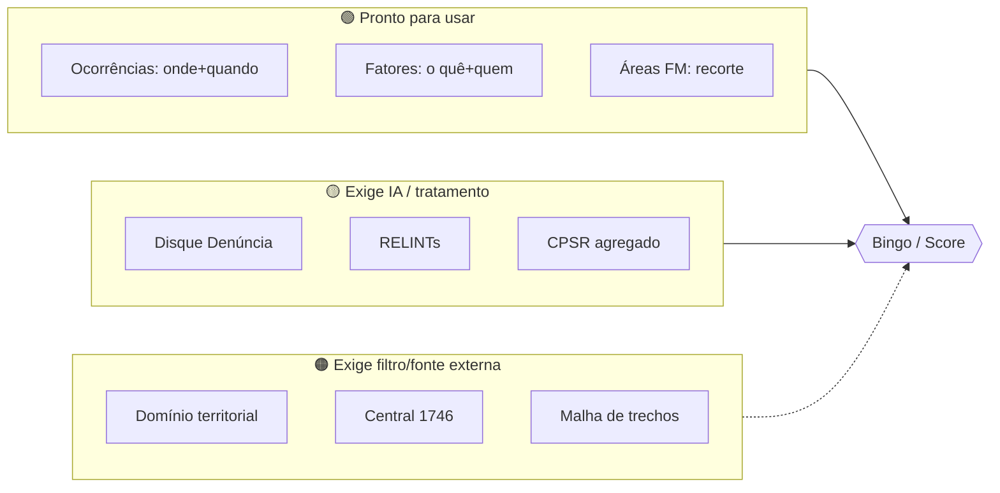

# 02 — Utilidade de Cada Fonte

Para que serve cada dado, lido no contexto do modelo CompStat: que **pergunta operacional** ele ajuda a responder, que **módulo do relatório** alimenta, e qual sua **força e limitação**. Voltar para a [visão geral](00-visao-geral.md) · ver [schemas](01-arquitetura-de-dados.md).

---

## 1. As 4 perguntas do CompStat × dados disponíveis

O produto existe para automatizar quatro respostas. Eis a leitura de viabilidade com os dados reais:

| Pergunta operacional | Resposta algorítmica | Fontes | Viabilidade hoje |
|----------------------|----------------------|--------|------------------|
| **Onde** patrulhar (maior incidência)? | Mapa de calor de roubos por trecho/área | Ocorrências + Polígonos FM | 🟢 **Alta** — 115k pontos georreferenciados |
| **Quando** patrulhar (horário de pico)? | Matriz hora × dia da semana | Ocorrências (`hora`, `dia_semana`) | 🟢 **Alta** — temporal completo (achado revisado) |
| **Como** empregar a FM (moto/viatura/a pé)? | Modalidade cruzada com modus operandi | Dinâmica criminal (DD + RELINT) + ocorrências | 🟡 **Média** — exige síntese de texto; restrição de 600 agentes |
| **Como** os órgãos resolvem os fatores? | Match fator → órgão responsável | Fatores urbanos (+ 1746, CPSR) | 🟢 **Alta** — órgão já vem no dado |

## 2. Os 6 módulos do relatório × dados que os alimentam

| Módulo do relatório | Fontes que o alimentam | Observação |
|---------------------|------------------------|------------|
| 1. Resumo executivo (respostas às 4 perguntas) | todas (síntese via LLM) | gerado por IA, validado por humano |
| 2. Mapa de calor | Ocorrências + Polígonos FM | sobreposição mancha × área |
| 3. Análise temporal | Ocorrências (`hora`/`dia_semana`/`mes`) | identifica picos (ex.: 19h às quartas) |
| 4. Dinâmica criminal | Disque Denúncia + RELINTs + Domínio territorial | síntese qualitativa |
| 5. Fatores urbanos | Fatores urbanos + CPSR + Central 1746 | mapeados pelas subprefeituras/órgãos |
| 6. Painel de coincidências + plano de ação | cruzamento das 3 camadas + Matriz Fatores×Órgãos | "bingos" priorizados + responsabilização |

---

## 3. Ficha de utilidade por fonte

### 🔴 Ocorrências criminais — *o esqueleto quantitativo*
- **Responde:** Onde e Quando. **Alimenta:** mapa de calor, análise temporal, score.
- **Força:** 115k registros, 5 anos, temporal e espacial completos, 99,97% de coords válidas. É a fonte mais robusta do acervo.
- **Limitação:** só roubo (sem furto); granularidade de trecho depende de agregar por área ou snapping (não há geometria de segmento). Possível viés de subnotificação por região.

### 🔵 Disque Denúncia — *o "como" e o "quem" da rua*
- **Responde:** Como empregar a FM (modus operandi). **Alimenta:** dinâmica criminal.
- **Força:** 18k denúncias, taxonomia rica (classe/tipo), texto livre com modus operandi, rotinas e pontos de droga. Cobre 2019-2026.
- **Limitação:** geolocalização/relato em só ~21%; é **indício não verificado**; PII e LGPD; coords ruidosas. Use para **enriquecer** a leitura qualitativa, não como contagem.

### 🟡 Fatores urbanos — *a ponte para a ação dos órgãos*
- **Responde:** Como os órgãos resolvem. **Alimenta:** módulo de fatores + plano de ação.
- **Força:** já traz o **fator + o órgão responsável + a subárea**, georreferenciado. É o que conecta o crime à intervenção urbana — coração da premissa do produto.
- **Limitação:** só 2.085 pontos, concentrados nas subáreas monitoradas; `valido` em ~60%; cuidado com o nome das coordenadas (invertido).

### ⚪ Polígonos FM — *a unidade de análise*
- **Responde:** recorta todas as outras camadas por área operacional. **Alimenta:** todos os módulos (define o "por área").
- **Força:** define o território de patrulhamento; CRS WGS84 pronto para cruzar com os pontos.
- **Limitação:** só 8 áreas hoje (de 22 previstas).

### 🔵 RELINTs — *o gabarito do entregável + dinâmica rica*
- **Responde:** Como empregar a FM. **Alimenta:** dinâmica criminal **e** define o formato de saída.
- **Força:** descreve rotas de fuga, pontos cegos, modus operandi e já traz **ações recomendadas** no formato esperado pelo cliente. Duplo papel: dado de entrada **e** molde de saída.
- **Limitação:** 8 relatórios, texto não estruturado (exige LLM para extrair).

### ⚪ Câmeras — *cobertura e pontos cegos*
- **Responde:** suporte ao Onde (vigilância). **Alimenta:** mapa de calor (sobrepõe câmeras) + desafio extra de cobertura.
- **Força:** 985 pontos com `id_trecho`; permite cruzar crime × vigilância.
- **Limitação:** só 9 áreas; falta a malha de trechos para fechar o `id_trecho`.

### 🔵 Domínio territorial — *contexto de facção e rota de fuga*
- **Responde:** contextualiza a dinâmica (controle territorial, receptação, fuga). **Alimenta:** dinâmica criminal.
- **Força:** polígonos de facção (CV/Milícia/TCP/ADA) para entender para onde o crime "escoa".
- **Limitação:** origem colaborativa (não oficial), cobre além do Rio, geometrias corrompidas. **Indício**, com filtro espacial.

### 🟡 CPSR — *fator urbano SMAS + evolução temporal*
- **Responde:** Como os órgãos (SMAS) atuam sobre PSR. **Alimenta:** fatores urbanos.
- **Força:** 3 ondas (2020/22/24) georreferenciadas → concentração e **evolução** de PSR por território.
- **Limitação:** microdado individual sensível — usar **agregado** por território/ano.

### 🟡 Central 1746 — *validação cidadã do fator urbano*
- **Responde:** reforça Como os órgãos resolvem. **Alimenta:** fatores urbanos (validação).
- **Força:** base pública massiva; "poste apagado", "poda", "lixo" confirmam o levantamento de campo.
- **Limitação:** externa (BigQuery, precisa de credencial); volume alto exige filtro por área/assunto.

---

## 4. Matriz Fatores Urbanos × Órgãos Responsáveis

Referência operacional para o módulo "plano de ação" (consolidada do `README` do repositório). Liga cada fator ao órgão que o resolve — é o que pré-popula a **matriz de responsabilização**.

| Categoria | Fator | Órgão responsável |
|-----------|-------|-------------------|
| Iluminação | Área mal iluminada (circulação de pedestres / parada de veículos) | **RioLuz** |
| Vegetação | Vegetação encobrindo iluminação / obstruindo visibilidade | **Comlurb** |
| Limpeza urbana | Lixo/entulho obstruindo visibilidade ou forçando pedestre à pista | **Comlurb** |
| Obstrução de logradouro | Mobiliário/calçada estreita desviando pedestre à pista | **Seconserva** |
| Refúgio | Mobiliário/tapume/vão servindo de esconderijo | **Seconserva** |
| Obstrução (comércio) | Comércio irregular obstruindo visibilidade | **SEOP** |
| Trânsito | Ponto de retenção de tráfego | **CET-Rio** |
| Trânsito | Estacionamento irregular / veículos de grande porte | **SEOP** |
| Trânsito | Motocicletas/bicicletas no passeio | **GM-Rio** |
| Ponto de ônibus | Ponto com histórico de vandalismo | **SMTR** |
| Pessoa em situação de rua | Adultos / crianças / famílias | **SMAS** |
| Cena de uso de drogas | Eventual / crônica | **SMAS** |

> Os valores reais de `orgao_responsavel` no dataset de fatores confirmam essa distribuição (COMLURB, SMAS, SEOP, Rio Luz, SECONSERVA, CET-Rio, GM-Rio, SMTR). A matriz é, portanto, **diretamente preenchível a partir do dado**.

## 5. Síntese: força do acervo por camada

