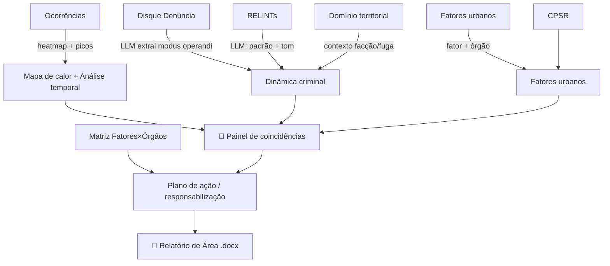

# 03 — Visão Geral de Possibilidades

O espaço de soluções que os dados habilitam: o **desafio principal**, os **4 desafios extras** do briefing e **ideias novas** que surgem do que vimos no acervo. Cada item traz dados usados, viabilidade e bloqueios. Voltar para a [visão geral](00-visao-geral.md).

> Legenda de viabilidade: 🟢 viável já · 🟡 viável com tratamento/IA · 🟠 depende de fonte externa ou decisão · 🔴 bloqueado hoje.

---

## A. Desafio principal — Relatório Analítico de Área automatizado

**O que é:** gerar, por área, um documento no formato do RELINT (ver [molde do RELINT no doc 01](01-arquitetura-de-dados.md)) com: resumo executivo (4 perguntas), mapa de calor, análise temporal, dinâmica criminal sintetizada, fatores urbanos e **painel de coincidências + plano de ação** (matriz de responsabilização pré-populada).

**Como os dados se encaixam:**

**Viabilidade:** 🟢 **alta para as 8 áreas** que têm polígono + RELINT + fatores. O temporal está completo (picos por hora/dia são extraíveis), o match fator→órgão é direto, e o RELINT serve de gabarito de formato.

**Bloqueios/decisões:**
- Granularidade: começar **por área** (point-in-polygon) em vez de trecho, enquanto não há malha de segmentos.
- "Bingo" sem geometria de trecho = coincidência **dentro da área** (mancha + fator + dinâmica na mesma área/buffer), não no mesmo segmento exato. Aceitável para o MVP.
- Saída `.docx`: replicar a estrutura de 7 blocos do RELINT.

---

## B. Os 4 desafios extras (briefing)

### Desafio 1 — Inteligência de Redes Sociais 🟠
Monitorar menções públicas (FM, relatos de crime) identificando *onde* e *como*, gerando alertas estruturados.
- **Dados:** nenhuma fonte de redes sociais no repositório → depende de coleta externa (APIs/scraping) + LLM de classificação.
- **Viabilidade:** 🟠 conceito claro, mas **sem dado no acervo**; é uma frente própria de ingestão.

### Desafio 2 — Migração do Crime no Território 🟡
Detectar/antecipar o deslocamento da criminalidade para áreas adjacentes quando se opera com intensidade.
- **Dados:** Ocorrências (5 anos, com tempo) + Polígonos FM.
- **Viabilidade:** 🟡 há série temporal suficiente para análise de deslocamento espaço-temporal entre áreas/bairros. Exige modelagem (séries por célula/área ao longo do tempo). Sem dado de *operação* (quando/onde a FM atuou), a "migração pós-operação" fica aproximada.

### Desafio 3 — Relatório de Decisão de Permanência (90 dias) 🟡
Apoiar a decisão de permanecer/sair de uma área consolidando indicadores e tendências.
- **Dados:** Ocorrências (tendência por área/mês) + Fatores (status) + CPSR (evolução).
- **Viabilidade:** 🟡 a série 2020-2024 permite comparativos e tendências por área. Falta o marco temporal das operações para medir efeito; pode-se começar com tendência de ocorrências por área e evolução de fatores.

### Desafio 4 — Otimização de Cobertura de Câmeras 🟢
Achar pontos cegos: locais com crime e sem câmera, para priorizar instalação.
- **Dados:** Ocorrências (985 câmeras com posição) × Câmeras × Polígonos FM.
- **Viabilidade:** 🟢 **direto** — sobrepor densidade de roubo com cobertura de câmera (buffer) e ranquear lacunas. É a possibilidade extra mais pronta com os dados atuais.

---

## C. Ideias novas habilitadas pelos dados

Surgiram da análise do acervo; ampliam o valor sem sair do espírito do projeto.

| Ideia | Dados | Viabilidade | Por quê |
|-------|-------|-------------|---------|
| **Matriz hora × dia de pico por área** | Ocorrências (`hora`,`dia_semana`) | 🟢 | Responde "quando patrulhar" com precisão; alimenta o módulo temporal e a escala da FM. |
| **Validação de fator pelo 1746** | Fatores × Central 1746 | 🟠 | Trecho com fator "poste apagado" + muitos chamados 1746 de iluminação = prioridade reforçada. Depende de acesso ao BigQuery. |
| **Câmera × crime (ponto cego)** | Ocorrências × Câmeras | 🟢 | = Desafio 4; também enriquece o relatório de área. |
| **Facção × rota de fuga** | Domínio territorial × RELINT × Ocorrências | 🟡 | Cruzar menção de rota de fuga (RELINT) com polígono de facção adjacente para hipótese de escoamento/receptação. Indício, não fato. |
| **PSR como fator territorial + tendência** | CPSR agregado × Fatores (SMAS) | 🟡 | Concentração e evolução de PSR por território como insumo da ação SMAS. Usar agregado (LGPD). |
| **Normalização por exposição/AISP** | Ocorrências + denominador populacional | 🟡 | Corrige o viés de realimentação (guardrail §13): score por taxa, não por contagem bruta. Depende de dado populacional por área. |
| **Extração estruturada de DD/RELINT (JSON)** | Disque Denúncia + RELINTs | 🟡 | Pipeline LLM que devolve {modalidade, modus operandi, rota de fuga, receptação, controle territorial} com fonte rastreável — Parte 1 do motor de IA. |

---

## D. Mapa de viabilidade (resumo)

| Possibilidade | Viab. | Dado pronto? | Maior bloqueio |
|---------------|:----:|:------------:|----------------|
| **Relatório de Área (8 áreas)** | 🟢 | sim | granularidade de trecho |
| Matriz temporal de pico | 🟢 | sim | — |
| Cobertura de câmeras (Desafio 4) | 🟢 | sim | — |
| Migração do crime (Desafio 2) | 🟡 | parcial | falta marco de operação |
| Decisão de permanência (Desafio 3) | 🟡 | parcial | falta marco de operação |
| Extração LLM de DD/RELINT | 🟡 | sim | engenharia de prompt/validação |
| Facção × fuga / PSR / 1746 | 🟡-🟠 | parcial | filtro espacial / fonte externa |
| Inteligência de redes sociais (Desafio 1) | 🟠 | não | ingestão externa inexistente |

**Leitura para o brainstorming:** o caminho de **maior valor com menor risco** combina o **Relatório de Área nas 8 áreas** (núcleo) com a **matriz temporal** e a **cobertura de câmeras** — tudo viável com o dado que já temos. Os itens 🟡/🟠 entram em ondas seguintes. Ver o sequenciamento em [`04-como-comecar.md`](04-como-comecar.md).
