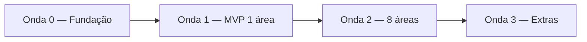

# 04 — Como Começar

Síntese do brainstorming: o que construir primeiro, em que ordem, e o que decidir antes de codar. Voltar para a [visão geral](00-visao-geral.md) · base conceitual em [`ideiainicial.md`](../../ideiainicial.md).

---

## 1. O insight que define o ponto de partida

As **8 áreas com polígono** (shapefile FM) batem **1:1 com os 8 RELINTs**, e essas mesmas áreas têm fatores urbanos, ocorrências e (em parte) câmeras. Ou seja: existe uma **fatia vertical completa** de dados para 8 áreas reais. Isso transforma a pergunta "por onde começar?" numa resposta concreta:

> **MVP = gerar automaticamente o Relatório Analítico de 1 área, ponta a ponta, e validar contra o RELINT humano correspondente.**

O RELINT existente vira o **critério de aceitação**: se o relatório gerado para a Rodoviária se aproxima do `RI_010` em estrutura, fatores citados e ações recomendadas, o motor funciona.

## 2. Definição do MVP

**Entrada:** 1 área (ex.: Presidente Vargas ou Rodoviária — as de maior cobertura de câmeras e dados).
**Processo:**
1. Recortar ocorrências, fatores, denúncias, câmeras e facções **dentro do polígono** da área (point-in-polygon / buffer).
2. Calcular **mancha** (densidade de roubo) e **picos temporais** (hora × dia).
3. Sintetizar **dinâmica criminal** via LLM a partir das denúncias e do RELINT da área (com fonte rastreável).
4. Listar **fatores urbanos** com órgão responsável (match direto).
5. Marcar **coincidências** (mancha + fator + dinâmica na mesma área/buffer) → score com justificativa legível.
6. Pré-popular a **matriz de responsabilização** (fator → órgão → ação).

**Saída:** um relatório (`.docx` ou tela) nos 7 blocos do RELINT, **com rótulo de "rascunho — requer validação humana"**.

**Critério de pronto:** o relatório de 1 área é coerente com o RELINT humano e cita a fonte de cada conclusão qualitativa.

## 3. Sequenciamento sugerido

Aproveitando as 4 frentes do [`ideiainicial.md` §12](../../ideiainicial.md) e ajustando ao dado real:

| Onda | Objetivo | Frentes | Entregável |
|------|----------|---------|------------|
| **0 — Fundação** | Ingestão limpa + modelo geoespacial | A (ingestão/schema) + C (geo) | Dados das 8 áreas carregados, normalizados (encoding, coords, filtro de facção), recortados por polígono. Query de coincidência por área funcionando com dado real. |
| **1 — MVP** | Relatório de **1 área** ponta a ponta | B (LLM) + C + D (frontend) | 1 relatório gerado e comparado ao RELINT; mapa de calor + matriz temporal da área. |
| **2 — Escala** | Generalizar para as **8 áreas** | todas | 8 relatórios; tela de refino humano; matriz de responsabilização. |
| **3 — Extras** | Possibilidades de maior valor | conforme prioridade | cobertura de câmeras (Desafio 4 🟢), migração do crime, validação 1746. |

**Por que nesta ordem:** a Onda 0 destrava todo o resto e expõe cedo os problemas de dado (coords invertidas, encoding, escopo de facção). O MVP de 1 área prova o conceito com baixo custo antes de escalar.

## 4. Decisões em aberto (resolver antes/no início)

| Decisão | Opções | Recomendação |
|---------|--------|--------------|
| **Stack** | A recomendada em [`ideiainicial.md` §11](../../ideiainicial.md) (React+Vite, MapLibre, Supabase/PostGIS, Claude API) vs outra | Confirmar com o time; a recomendada favorece "implantável rápido". |
| **Granularidade do "bingo"** | por área (já) vs por trecho (precisa malha) | Começar por **área**; buscar malha de trechos como evolução. |
| **Furto** | dado só tem roubo | Alinhar escopo com o cliente; não prometer furto. |
| **Escopo geográfico de facção** | base cobre além do Rio + lixo | Filtrar bbox do município já na ingestão. |
| **Fonte de denominador** (normalização) | população por área? | Buscar para mitigar viés de realimentação. |
| **Acesso ao 1746 (BigQuery)** | credencial GCP | Decidir se entra no MVP ou depois. |

## 5. Riscos de dado a vigiar (do [doc 01](01-arquitetura-de-dados.md#12-tabela-consolidada-de-achados-de-qualidade))

- **Coordenadas de fatores com nome invertido** — confiar nos valores (x=lat, y=lon), não no dicionário.
- **Disque Denúncia** — latin-1 + `;`; relato/coords só em ~21%; PII.
- **Domínio territorial** — geometrias corrompidas (lat +33) e escopo estadual; filtrar.
- **`data` de ocorrências** com ano corrompido — usar `ano`/`mes`/`hora`/`dia_semana`.
- **Cadastros de área divergentes** entre fontes — normalizar nomes.

## 6. Guardrails de IA responsável (não negociáveis — [§13](../../ideiainicial.md))

- **Decisão final sempre humana.** O sistema entrega rascunho + score + justificativa.
- **Foco no ambiente, não no indivíduo.** Fatores urbanos e patrulha, não vigilância de pessoas.
- **Texto livre é indício, não fato.** Citar fonte (DD/RELINT) e sinalizar incerteza.
- **Nunca inventar dado.** Camada ausente é declarada; score com dado insuficiente = baixa confiança.
- **Evitar viés de realimentação.** Considerar normalização por exposição.
- **LGPD.** Agregados territoriais; minimizar dado pessoal (DD, CPSR).
- **Transparência.** Toda priorização tem justificativa legível.

## 7. Checklist de primeiros passos

- [ ] Time alinha **stack** e **área-piloto** do MVP.
- [ ] Onda 0: script de ingestão das 8 áreas com **encoding/coords/filtros corrigidos** (os achados de qualidade do [doc 01](01-arquitetura-de-dados.md#12-tabela-consolidada-de-achados-de-qualidade) já mapeiam o que tratar).
- [ ] Carregar geometrias e rodar **point-in-polygon** das fontes pontuais nas 8 áreas.
- [ ] Implementar **query de coincidência por área** (mancha + fator + dinâmica) com dado real.
- [ ] **Pipeline LLM** de extração de DD/RELINT em JSON estruturado (modalidade, modus operandi, rota de fuga, receptação, controle territorial) com fonte rastreável.
- [ ] **Matriz temporal** (hora × dia) e **mapa de calor** da área-piloto.
- [ ] Geração do **relatório de 1 área** + comparação com o RELINT humano.
- [ ] **Tela de refino humano** e matriz de responsabilização.
- [ ] (Opcional) atualizar a seção 15 do `ideiainicial.md` apontando para esta documentação.

---

> **Próximo passo natural:** escolher a área-piloto e fechar a stack. A partir daí, a Onda 0 pode começar imediatamente — os dados estão mapeados, perfilados e com os riscos identificados.
